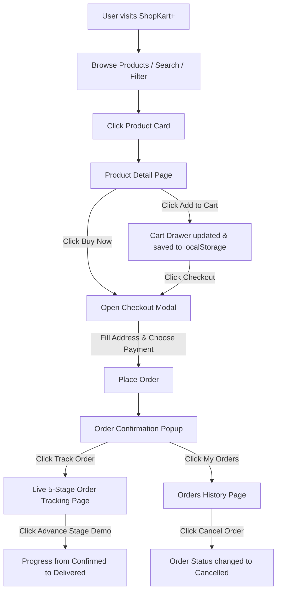

# 🛒 ShopKart+ Advanced — Complete Code & Architecture Guide

Intha document ungaloda existing code-ah romba easy-ah, step-by-step purinjikka create pannirukkom. 
**Note:** Existing project code-la endha changes-um pannala. Intha file ungalukku reference & understanding purpose-kaga mattume.

---

## 📑 Table of Contents
1. [Project Overview & Technology Stack](#1-project-overview--technology-stack)
2. [Folder Structure & File Responsibilities](#2-folder-structure--file-responsibilities)
3. [File 1: index.html](#3-file-1-indexhtml)
4. [File 2: package.json & vite.config.js](#4-file-2-packagejson--viteconfigjs)
5. [File 3: src/data/products.json](#5-file-3-srcdataproductsjson)
6. [File 4: src/main.jsx — Deep Dive](#6-file-4-srcmainjsx--deep-dive)
   - [6.1 Helper / Utility Functions](#61-helper--utility-functions)
   - [6.2 App Component & State Management](#62-app-component--state-management)
   - [6.3 Card Component](#63-card-component)
   - [6.4 CategoryRow Component](#64-categoryrow-component)
   - [6.5 Product (Detail View) Component](#65-product-detail-view-component)
   - [6.6 Cart (Slide Drawer) Component](#66-cart-slide-drawer-component)
   - [6.7 CheckoutModal Component](#67-checkoutmodal-component)
   - [6.8 OrderConfirmationModal Component](#68-orderconfirmationmodal-component)
   - [6.9 OrderTracking Component](#69-ordertracking-component)
   - [6.10 Orders Component](#610-orders-component)
   - [6.11 Auth (Login / Signup) Component](#611-auth-login--signup-component)
   - [6.12 Empty Component](#612-empty-component)
7. [File 5: src/styles.css — Design & Theme System](#7-file-5-srcstylescss--design--theme-system)
8. [End-to-End User Flow (Diagram)](#8-end-to-end-user-flow-diagram)

---

## 1. Project Overview & Technology Stack

- **Framework**: React 18 (Hooks-based functional components).
- **Bundler & Dev Server**: Vite 5.
- **Styling**: Vanilla CSS with CSS Custom Properties (Variables) for Light & Dark mode.
- **Data Storage**: Browser `localStorage` (No external database needed; persists user, cart, wishlist, orders, and theme).
- **Data Source**: Local dataset (`products.json`) as instant fallback + API sync from `dummyjson.com`.

---

## 2. Folder Structure & File Responsibilities

```
shopkart-advanced-premium-marketplace/
├── frontend/
│   ├── index.html               # Main HTML entry point (contains theme pre-load script)
│   ├── package.json             # Project dependencies and npm scripts
│   ├── vite.config.js           # Vite configuration for React plugin
│   ├── README.md                # Project summary
│   ├── src/
│   │   ├── App.jsx              # Main React orchestrator & state manager
│   │   ├── main.jsx             # Entry point mounting <App />
│   │   ├── styles.css           # Complete CSS styling & Theme variables
│   │   ├── data/
│   │   │   └── products.json    # 30+ products local fallback dataset
│   │   ├── utils/               # Helper utilities (helpers.js, categoryIcons.js, api.js)
│   │   └── components/          # Modular React components organized by feature

```

---

## 3. File 1: `index.html`

### What it does:
1. **Google Fonts (`Inter`)**: Loads high-quality modern typography.
2. **Theme Initialization Script (Lines 10-17)**:
   ```javascript
   (function() {
     try {
       var savedTheme = localStorage.getItem('sk-theme');
       var theme = savedTheme || (window.matchMedia('(prefers-color-scheme: dark)').matches ? 'dark' : 'light');
       document.documentElement.setAttribute('data-theme', theme);
     } catch (e) {}
   })();
   ```
   - **Why this script is here**: It runs immediately *before* React loads. This avoids the "white flash" (FOUC) when opening the page in Dark Mode.
3. `<div id="root"></div>`: The React mount container.
4. `<script type="module" src="/src/main.jsx"></script>`: Connects the React entry file.

---

## 4. File 2: `package.json` & `vite.config.js`

- **`package.json`**:
  - `scripts.dev`: `vite` — Starts local development server at `http://localhost:5173`.
  - `scripts.build`: `vite build` — Creates optimized production build in `dist/`.
  - `dependencies`: React 18, React-DOM, Vite, and `@vitejs/plugin-react`.
- **`vite.config.js`**:
  - Configures `@vitejs/plugin-react` to support JSX compilation and Fast Refresh.

---

## 5. File 3: `src/data/products.json`

### What it does:
A collection of product objects. Each product contains:
- `id`: Unique number (e.g., 1, 2, 3...).
- `title`: Name of the product (e.g., "iPhone 9", "MacBook Pro").
- `description`: Product details and features.
- `price`: Base price (converted dynamically into INR in the UI).
- `discountPercentage`: Discount offer (e.g., 12.96%).
- `rating`: Rating out of 5 (e.g., 4.69).
- `stock`: Available stock count.
- `brand`: Brand name (e.g., "Apple", "Samsung").
- `category`: Category name (e.g., "smartphones", "laptops", "fragrances").
- `thumbnail`: Main image URL.
- `images`: Array of extra image URLs for gallery preview.

---

## 6. File 4: `src/main.jsx` — Deep Dive

This is the heart of the application. Let's break it down section by section:

### 6.1 Helper / Utility Functions

1. **`getINR(n)` (Line 14)**:
   - Converts raw price to Indian Rupee (₹).
   - If price > 500, assumes it's already in INR; otherwise multiplies USD price by 83.5 and rounds to whole number.
2. **`money(n)` (Line 15)**:
   - Formats number with Indian comma separation (e.g., `₹1,24,999`).
3. **`getCategoryIcon(category)` (Lines 17-37)**:
   - Returns matching emoji icon for categories (e.g., `'laptop'` -> 💻, `'phone'` -> 📱, `'shoe'` -> 👟).
4. **`WishlistHeartIcon({ liked })` (Lines 39-68)**:
   - An animated SVG heart with custom gradient fill when active (`liked = true`).
5. **`api(endpoint)` (Lines 70-77)**:
   - Client-side rate-limited fetch helper.
   - Allows maximum 40 requests per minute to prevent API hammering.

---

### 6.2 `App` Component & State Management (Lines 79-693)

`App` is the master component controlling all global states:

#### Key States:
| State Variable | Purpose |
|---|---|
| `p` | Product list (Initialized from `products.json`, supplemented by `dummyjson.com`) |
| `q` | Search query string (typed in the search input) |
| `cat` | Currently selected category (`'all'`, `'laptops'`, `'smartphones'`, etc.) |
| `priceFilter` | Price range filter (`'all'`, `'under1000'`, `'1000to5000'`, `'above5000'`) |
| `sortBy` | Sorting order (`'featured'`, `'price-asc'`, `'price-desc'`, `'rating'`) |
| `sel` | Currently selected product object (when clicking a product for detail view) |
| `page` | Active page route: `'home'`, `'wishlist'`, `'orders'`, `'tracking'` |
| `slide` | Current index of hero banner carousel (0, 1, 2) |
| `cart` | Array of items in cart `[{ id, title, price, qty, thumbnail, ... }]` |
| `wish` | Array of favorited wishlist items |
| `orders` | Array of placed orders with delivery stages and tracking IDs |
| `user` | Logged-in user information (or `null` if guest) |
| `cartOpen` | Boolean: Controls whether the slide-over Cart drawer is open |
| `auth` | Boolean: Controls whether the Login/Register popup is open |
| `toast` | Toast notification message string |
| `checkoutOpen` | Boolean: Controls checkout modal |
| `theme` | Theme mode: `'light'` or `'dark'` |
| `trackingOrderId`| ID of the order currently being tracked in the live tracker |

#### Key Handler Functions inside `App`:
- `add(product)`: Adds item to cart or increments quantity if already present.
- `updateCartQty(id, qty)`: Increases, decreases, or removes items from cart.
- `removeFromCart(id)`: Deletes an item from cart.
- `wishIt(product)`: Toggles item in/out of wishlist.
- `startCheckout(items)`: Opens the checkout modal for cart items or "Buy Now" single item.
- `handlePlaceOrder(details)`: Creates a new order with unique ID (e.g. `SK48291`), empties cart, saves to `localStorage`, and displays confirmation modal.
- `advanceOrderStage(orderId)`: Simulates real-time order progression (`Order Confirmed` -> `Processing` -> `Shipped` -> `Out for Delivery` -> `Delivered`).
- `cancelOrder(orderId)`: Cancels the order and updates status to "Cancelled".

---

### 6.3 `Card` Component (Lines 695-750)

Displays individual product in grid view:
- **3D Tilt & Glass Hover**: Modern card style with image zoom on hover.
- **Dynamic Pricing & Discount Tag**: Displays current price, strike-through original price, and `% OFF` badge.
- **Stock Alert**: Badges indicating "In Stock" or "Low Stock".
- **Action Buttons**: Wishlist heart button (top right) and "Add to Cart" button.

---

### 6.4 `CategoryRow` Component (Lines 752-792)

- Horizontal swipeable carousel displaying category collections.
- Includes left/right navigation scroll buttons with smooth scrolling.

---

### 6.5 `Product` (Detail View) Component (Lines 794-891)

Renders full single-product view when a user clicks on any card:
- **Image Gallery**: Main large photo + interactive thumbnail selector.
- **Specifications & Rating**: Star rating display, reviews count, brand info.
- **Quick Action Bar**:
  - `Add to Cart` button (with quantity bump animation).
  - `Buy Now` button (directly triggers checkout modal for instant purchase).
  - Wishlist toggle.
- **Customer Reviews**: Shows user ratings and feedback cards.
- **Related Products**: Displays 4 recommended products from the same category.

---

### 6.6 `Cart` (Slide-Over Drawer) Component (Lines 893-974)

- Appears from the right side of the screen when clicking the cart icon.
- Displays list of cart items with image, title, unit price, and total.
- **Quantity Adjuster**: `[-]` and `[+]` buttons to change quantity dynamically.
- **Order Summary**: Subtotal, Free Shipping badge, and Estimated Total.
- **Proceed to Checkout Button**: Triggers `CheckoutModal`.

---

### 6.7 `CheckoutModal` Component (Lines 976-1172)

A comprehensive multi-step checkout workflow:
1. **Customer & Address Form**: Full name, mobile number, delivery address, city, pincode.
2. **Payment Method Selector**:
   - 💵 **Cash on Delivery (COD)**
   - ⚡ **UPI / QR Code** (Google Pay, PhonePe, Paytm)
   - 💳 **Credit / Debit Cards & Net Banking**
3. **Order Breakdown**: Itemized price list, discounts, taxes, and final payable amount.
4. **Place Order Action**: Validates form inputs and invokes `onPlaceOrder()`.

---

### 6.8 `OrderConfirmationModal` Component (Lines 1174-1222)

- Celebratory success dialog after placing an order.
- Features animated green checkmark, generated Order ID, estimated delivery date, and order receipt summary.
- Provides direct "Track Order" button.

---

### 6.9 `OrderTracking` Component (Lines 1224-1368)

Real-time interactive delivery tracking dashboard:
- **5-Stage Step Progress Bar**:
  1. `Order Confirmed` 📦
  2. `Processing & Packed` 🏭
  3. `Shipped / In Transit` 🚚
  4. `Out for Delivery` 🛵
  5. `Delivered` 🎉
- **Live Simulation Controller**: "Advance Delivery Stage" button allows testing and demonstrating stage-by-stage progression in real time.
- **Courier & Map Simulation**: Shows courier name, estimated arrival, and simulated delivery route.

---

### 6.10 `Orders` Component (Lines 1370-1425)

- "My Orders" history page.
- Lists all placed orders with items, date, price, and current delivery status badge.
- Provides **Track Order** and **Cancel Order** actions for each order.

---

### 6.11 `Auth` (Login / Signup) Component (Lines 1427-1611)

- Authentication modal with smooth tab switching between "Sign In" and "Create Account".
- Form validation for email & password.
- **Quick Guest Login button**: Lets demo users log in instantly with 1-click without filling forms.
- Stores logged-in profile in `localStorage`.

---

### 6.12 `Empty` Component (Lines 1613-1622)

- Clean placeholder view displayed when search yields no results, or when Wishlist / Cart / Orders are empty.

---

## 7. File 5: `src/styles.css` — Design & Theme System

### Key CSS Features:
1. **Dual Design System Variables**:
   - `[data-theme="light"]`: Daylight Clean aesthetic with subtle blues and slate texts (`#f8fafc`, `#ffffff`, `#2563eb`).
   - `[data-theme="dark"]`: Cyber-luxe Obsidian aesthetic with glowing nebula accents and deep slate cards (`#090d16`, `#0f172a`, `#3b82f6`).
2. **Glassmorphism**:
   ```css
   backdrop-filter: blur(16px);
   -webkit-backdrop-filter: blur(16px);
   ```
   Used for sticky navigation header, cart drawer, and modals.
3. **Micro-Animations**:
   - Cart counter bounce badge (`bump` animation).
   - Wishlist heart pulse on like.
   - Smooth slide-in for modals and drawers.
4. **Responsive Layouts**:
   - Grid layout adapts automatically from 1 column (mobile) -> 2 columns (tablet) -> 3/4 columns (desktop).

---

## 8. End-to-End User Flow (Diagram)



---

## 💡 Summary / Quick Takeaway

- **Everything is organized in one clean component tree inside `src/main.jsx`**.
- **No external state management library (like Redux) was needed** because React's built-in `useState`, `useEffect`, `useMemo`, and `useRef` handle all state and caching cleanly.
- **Persistence is handled automatically with `localStorage`**, so reloading the page retains your theme, cart items, wishlist, and orders.
